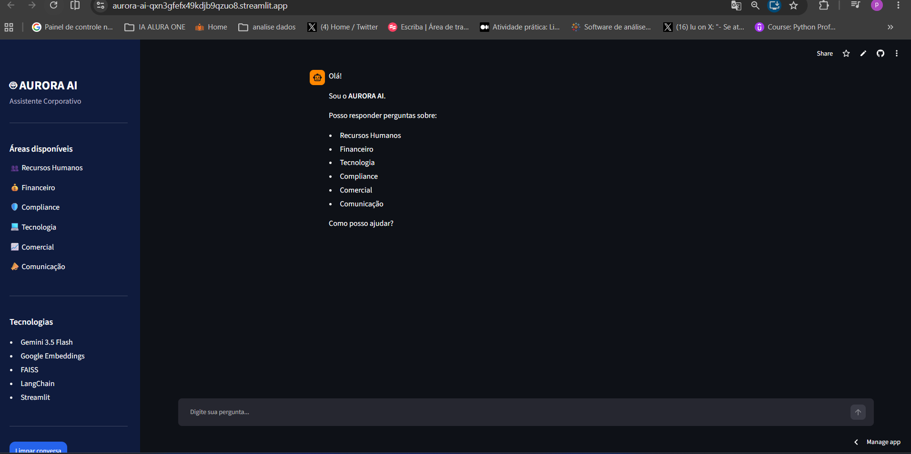
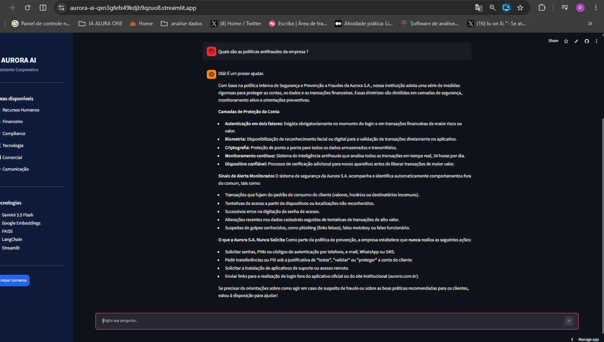

<h1 align="center">🤖 Aurora AI</h1>

<p align="center">
  <strong>Assistente Corporativo Inteligente utilizando RAG, Google Gemini e Streamlit</strong>
</p>

<p align="center">
  Desenvolvido para responder dúvidas de colaboradores utilizando exclusivamente a documentação interna da empresa.
</p>

<p align="center">
  
  
  
  
  
</p>


<p align="center">
  <a href="https://aurora-ai-qxn3gfefx49kdjb9qzuo8.streamlit.app/">
    🌐 Acessar Aplicação
  </a>
  •
  <a href="https://github.com/Pedro-Lucas-Vieira/Aurora-AI.git">
    📂 Repositório GitHub
  </a>
</p>

---

## 🎥 Vídeo de Demonstração

<p align="center">
  
  <<a href="https://youtu.be/cP88x4F2OfM">
     
   </a>
</p>


---


## 📖 Sobre o Projeto

O **AURORA AI** é um assistente corporativo baseado na arquitetura **Retrieval-Augmented Generation (RAG)**.

A aplicação permite consultar documentos internos da Aurora S.A. por meio de conversas em linguagem natural. A Aurora S.A. é uma instituição financeira fictícia que oferece conta digital, crédito empresarial, cartões corporativos e investimentos para empresas de todos os portes.

Antes de responder qualquer pergunta, o sistema realiza uma busca semântica utilizando **FAISS**, recupera os documentos mais relevantes e envia essas informações como contexto para o **Google Gemini**, garantindo respostas fundamentadas exclusivamente na documentação disponível.

Essa abordagem reduz significativamente a geração de respostas incorretas (alucinações) e torna a aplicação mais confiável.

---

## 📂 Documentos Suportados

O AURORA AI pode processar automaticamente os seguintes formatos de documentos:

- PDF (.pdf)
- Word (.docx)
- Excel (.xlsx)
- PowerPoint (.pptx)
- Markdown (.md)
- HTML (.html)
- JSON (.json)
- CSV (.csv)
- TXT (.txt)
---

## 🚀 Como Funciona

O fluxo da aplicação segue a arquitetura **RAG (Retrieval-Augmented Generation)**:

1. O usuário envia uma pergunta.
2. A pergunta é transformada em embeddings.
3. O FAISS pesquisa os documentos mais relevantes.
4. Os trechos encontrados são enviados ao Google Gemini.
5. O modelo gera uma resposta baseada exclusivamente na documentação recuperada.

---

## ✨ Funcionalidades

- 💬 Chat corporativo em linguagem natural
- 📚 Busca semântica utilizando FAISS
- 🧠 Respostas utilizando Google Gemini
- 📄 Recuperação inteligente de documentos (RAG)
- 🔒 Proteção da API Key com variáveis de ambiente
- 📝 Histórico de conversa
- 🎨 Interface moderna desenvolvida em Streamlit

---

## ❓ Exemplos de Perguntas

Algumas perguntas que podem ser feitas ao AURORA AI, de acordo com a documentação carregada:

- "Quais são as políticas antifraude da empresa?"
- "Quais  são  os produtos da empresa ?"
- "Qual é a Demonstração do Resultado do Exercício (DRE)?"
- "Quais são os Princípios Éticos da empresa ?"
- "Quantos clientes pertencem à agência "0032"?"
- "Qual a data que o Comunicado Institucional foi publicado ?"
- "Quais são serviços isentos de tarifas ?"

> 💡 As respostas são geradas exclusivamente com base nos documentos internos indexados na pasta `documentos/`.

---

## 📷 Imagens da Aplicação com Respostas Geradas Pelo Agente

<p align="center">
  
  
  
  
</p>


---

## 🛠️ Tecnologias Utilizadas

| Tecnologia | Utilização |
|------------|------------|
| Python 3.13 | Linguagem principal |
| Streamlit | Interface Web |
| LangChain | Orquestração do RAG |
| Google Gemini | Modelo de linguagem |
| Google Generative AI Embeddings | Vetorização |
| FAISS | Banco Vetorial |
| python-dotenv | Variáveis de ambiente |

---

## 🏗️ Arquitetura

```text
                    Usuário
                       │
                       ▼
              Interface Streamlit
                       │
                       ▼
                  LangChain
                       │
                       ▼
             Busca Vetorial (FAISS)
                       │
                       ▼
        Documentação Corporativa
                       │
                       ▼
              Google Gemini
                       │
                       ▼
              Resposta ao Usuário
```

---

## 📁 Estrutura do Projeto

```text
AURORA-AI/
│
├── app.py
├── chatbot.py
├── criar_base.py
├── leitor_documentos.py
├── requirements.txt
├── .gitignore
│
├── documentos/
│   ├── Comercial/
│   ├── Compliance/
│   ├── Financeiro/
│   ├── RH/
│   └── TI/
│
└── vectorstore/
```

---

## ⚙️ Como Executar Localmente

### 1. Clone o repositório

```bash
git clone https://github.com/Pedro-Lucas-Vieira/Aurora-AI.git
```

### 2. Entre na pasta do projeto

```bash
cd Aurora-AI
```

### 3. Crie um ambiente virtual

```bash
python -m venv venv
```

### 4. Ative o ambiente virtual

**Windows**

```bash
venv\Scripts\activate
```

**Linux / macOS**

```bash
source venv/bin/activate
```

### 5. Instale as dependências

```bash
pip install -r requirements.txt
```

### 6. Configure a API do Google Gemini

Crie um arquivo chamado `.env` na pasta principal do projeto e adicione sua chave:

```env
GOOGLE_API_KEY=SUA_API_KEY
```

### 7. Crie a base vetorial

Antes de executar o sistema pela primeira vez, gere a base vetorial com:

```bash
python criar_base.py
```

### 8. Execute a aplicação

```bash
streamlit run app.py
```

A aplicação será aberta automaticamente no navegador.

---

## 📄 Como Atualizar a Base

Sempre que novos documentos forem adicionados, removidos ou alterados na pasta `documentos/`, é necessário reconstruir a base vetorial para que o assistente passe a considerar essas mudanças.
Não é necessário executar o arquivo `leitor_documentos.py`, pois ele é utilizado automaticamente pelo `criar_base.py` durante o processamento dos documentos.

```bash
python criar_base.py
```

> ⚠️ Esse comando reprocessa todos os arquivos da pasta `documentos/`, gera novamente os embeddings e substitui a base vetorial existente em `vectorstore/`. Recomenda-se executá-lo sempre após qualquer atualização na documentação interna.

---

## 🌐 Deploy

A aplicação está disponível no **Streamlit Community Cloud**.

**Acesse:**

👉 https://aurora-ai-qxn3gfefx49kdjb9qzuo8.streamlit.app/

---

## 🔒 Segurança

A chave da API do Google Gemini não é armazenada no código-fonte.

Durante o desenvolvimento local, ela é carregada através de um arquivo `.env`.

Em produção, a chave é configurada utilizando o recurso **Secrets** do Streamlit Community Cloud, garantindo que informações sensíveis permaneçam protegidas.

---

## 📄 Licença

Este projeto foi desenvolvido para fins educacionais e para demonstração de habilidades em Inteligência Artificial, Retrieval-Augmented Generation (RAG), Python, LangChain e Streamlit.

---

## 👨‍💻 Autor

<p align="center">
  <strong>Pedro Lucas</strong>
</p>

<p align="center">
  <a href="https://github.com">
    
  </a>
</p>

---